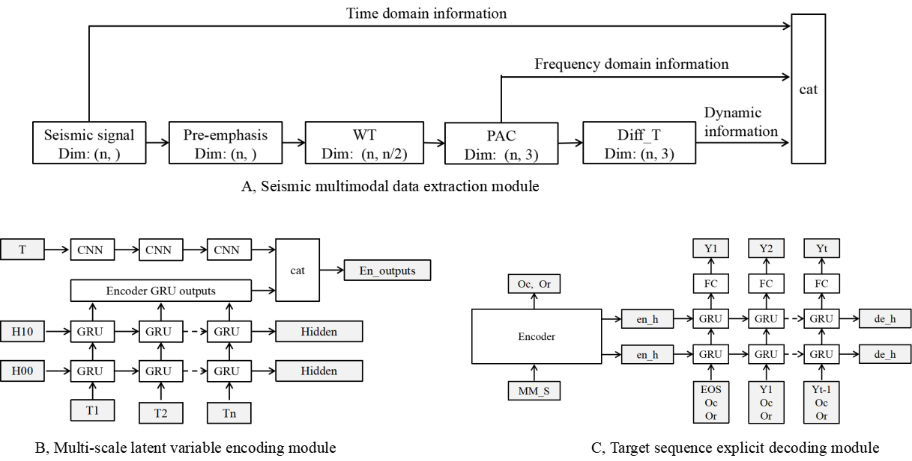

# MSSI




### **What is this repository for?**

MSSI is a software for paper 《Multimodal Seismic Inversion Based on Explicit Sequence Decoder》.


### Who do I talk to?

Yu Sun； 
a. School of Earth Sciences, Northeast Petroleum University, Daqing 163318, China;
b. National Key Laboratory of Continental Shale Oil, Northeast Petroleum University, Daqing, Heilongjiang 163318, China

E-mail: [191981070190@nepu.edu.cn](mailto:191981070190@nepu.edu.cn;);


### Quick Start

1、Download the M2 dataset from the provided link.

​		M2: https://doi.org/10.5281/zenodo.14233581

2、Place the downloaded ''marmousi_Ip_model.npy'' and "marmousi_synthetic_seismic.npy" in the "data/M2/'' directory with the specified names

​		M2 label: `data/M2/marmousi_Ip_model.npy`

​		M2 seismic: `data/M2/marmousi_synthetic_seismic.npy`

3、Run `train_1D.py` file.


### Usage

1、Download the M2 dataset from the provided link.

​		M2: http://www.agl.uh.edu/downloads/downloads.htm

2、The downloaded original SGY-format M2 dataset is processed into NPY file format. Using the provided velocity and density datasets, an impedance 	        		dataset can be calculated. Additionally, forward modeling can be employed to generate seismic data based on the impedance dataset.

3、Place the seismic data and seismic inversion labeling data in the data/ directory with the specified names

​		M2 label: `data/M2/marmousi_Ip_model.npy`

​		M2 seismic: `data/M2/marmousi_synthetic_seismic.npy`

4、Use `setting.py` to set the hyperparameters.

5、Train the MSSI models using `train_1D.py`. or `train_seq2seq_1D.py`

6、Test the MSSI models using `test_1D.py`  or `test_seq2seq_1D.py` to generate seismic inversion results for each seismic trace.


### **code introduction**

```
	1、train_1D.py:
		Trains non-seq2seq models. including：CNN, GRU, CNN+GRU, TCN, Unet, W/O att_Dec
		
	2、test_1D.py:
		test non-seq2seq models. including：CNN, GRU, CNN+GRU, TCN, Unet,W/O att_Dec

	3、train_seq2seq_1D.py:
		Trains seq2seq models. including ：MSSI，W/O MSE, W/O MAE, W/O MM

	4、test_seq2seq_1D.py
		Tests seq2seq models. including ：MSSI，W/O MSE, W/O MAE, W/O MM
		
	5、setting.py
		Hyperparameter setting

	6、X70_show.py
		Visualizes the X70 dataset.

	7、data:
		Stores the raw dataset.
		Obtains the dataset.M2, X70
		M2: marmousi_Ip_model.npy, marmousi_synthetic_seismic.npy

	8、model:
		Stores the model-related code.
		
	9、save_train_model:
		Stores the trained models.
		
	10、result:
		Stores seismic profiles and seismic Inversion profiles during the testing process.

	11、utils:
		Contains data processing code.

MSSI：
The multimodal data acquisition module of MSSI uses a combination of wavelet transform and principal 
component analysis to obtain the frequency domain information and dynamic information of seismic signals. 

The multi-scale latent variable encoding module of MSSI employs a parallel approach using a Convolutional 
Neural Network (CNN) and Gate Recurrent Unit (GRU) to capture both global and local information of the seismic sequence. 

The decoder module of MSSI utilizes a GRU with attention mechanism to explicitly 
learn the sedimentary patterns embedded in the target sequences and address the long-range dependencies 
of the target sequences on the seismic sequences.
```

```
Acknowledgments：
We would like to express our gratitude to the University of Houston for providing the Marmousi2 (M2) dataset, which has been instrumental in validating our proposed model for seismic data analysis.
original data download link: http://www.agl.uh.edu/downloads/downloads.htm
processed data download link: https://doi.org/10.5281/zenodo.14233581
```

